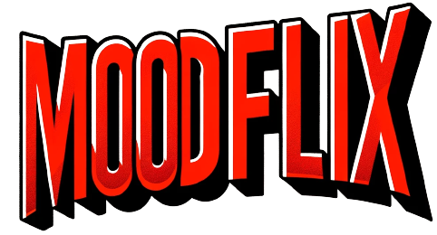

# Moodflix

Ever had one of those days where you're thinking, "I'm feeling so blue, a rom-com is just the thing," or "I'm on top of the world, bring on the action"? Well, Moodflix is here to save your movie night.
Get tailored recommendations based on your current feels. Say goodbye to endless scrolling and hello to the ideal movie match.
Whether you're in the mood for some drama, thrills, or romance, Moodflix is your new best cinema friend. Let's get those movie vibes going!

## Inspiration
The idea behind Moodflix was sparked by the [Viberary](http://viberary.pizza) website, created by [@vboykis](https://twitter.com/vboykis).
Viberary uses a similar approach of suggesting books based on the user's vibes. Seeing its potential, I felt a similar concept could be applied to movies.
So, taking a cue from Viberary, Moodflix was born, aiming to match movies with moods for a tailored viewing experience.

## The Data
The dataset provides metadata about the top 10,000 movies from **The Movie Database (TMDB)**. Encompassing a diverse set of attributes, details such as movie titles, release dates, runtime, genres, production companies, budget, and revenue are included. Key attributes highlighted are the unique identifier (`id`), movie title (`title`), associated genres (`genres`), the original production language (`original_language`), average user rating (`vote_average`), a popularity score based on user engagement (`popularity`), a brief synopsis (`overview`), the production budget in USD (`budget`), the movie's total revenue in USD (`revenue`), the movie's duration in minutes (`runtime`), and its promotional tagline (`tagline`). This data, sourced from TMDB, was retrieved from Kaggle and has been processed for enhanced quality and usability.

**Source:** [Top 10000 popular Movies TMDB](https://www.kaggle.com/datasets/ursmaheshj/top-10000-popular-movies-tmdb-05-2023)

## Indexing the movies
The ingestion pipelines processes the data and prepares it for similarity-based recommendations.
It utilizes the `sentence-t5-large` model from SentenceTransformers to convert textual information from movie titles, genres, overviews, and taglines into numerical embeddings.
These embeddings serve as condensed representations, capturing the content nuances of each film, facilitating efficient similarity comparisons.

To enable rapid similarity searches, the we use the `hnswlib` library to create a search index based on the HNSW (Hierarchical Navigable Small World) algorithm.
This indexing approach ensures fast and accurate retrieval, making it suitable for real-time movie recommendations.
Once processed, the structured movie details are stored, and the search index is saved, paving the way for subsequent recommendation operations.

## Searching for similar movies
Upon receiving the user's mood input, we encode the text into a numerical vector embedding.
This embedding is essentially a dense vector that captures the essence of the user's mood in a format conducive to similarity comparisons.
The generated embedding is then used as a search query in the `hnswlib` index to perform a k-nearest neighbors search.
This search retrieves movies with embeddings that are most similar to the mood embedding, ensuring that the movies align closely with the user's specified mood.

